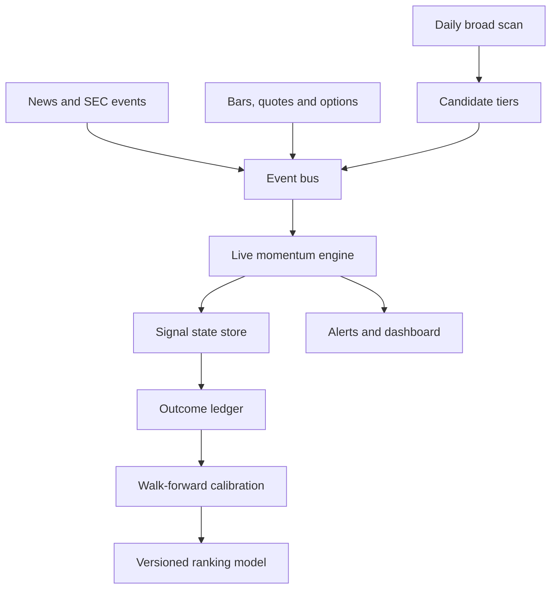

# Market Hunt V4 Architecture

Status: **V4.6 controlled-cutover implementation / shadow mode**. V3 remains
the production path until the validation gates below pass. V4 never enables
broker execution.

## Objective

Identify developing liquid U.S. stocks capable of a 10%+ move, estimate the
probability from measured outcomes, and promote a setup only when its catalyst,
price, volume, risk/reward and live confirmation become actionable.

## Target topology



## Bounded contexts

| Context | Responsibility | V4 foundation status |
| --- | --- | --- |
| Discovery | Full-universe quality gates, themes, structures and 10% capability | Reuses proven V3 |
| Candidate routing | HOT/WARM tiers with a bounded live-data budget | Implemented |
| Event ingestion | Normalize bars, quotes, catalysts, options and tape | Candidate, price, SEC, news, earnings-calendar, options and bar-microstructure shadow adapters implemented |
| Live momentum | Deterministic WATCH → ARMED → TRIGGERED → CONFIRMED lifecycle | Continuous shadow worker implemented |
| State/event storage | Idempotent append-only events plus current signal state | File shadow adapter implemented |
| Catalyst intelligence | SEC/news classification and magnitude | V4.3 bounded polling and conservative veto layer implemented |
| Outcome intelligence | MFE, MAE, +5/+10/+15%, R-multiple and failure reason | V4.2 event ledger and daily resolver implemented |
| Calibration | Walk-forward probabilities by setup and regime | V4.5 time-split calibrated ranking model implemented in shadow |
| Delivery | Mobile dashboard and actionable alerts | Deduplicated audit/Telegram alert router implemented |

## Core design rules

1. **V3 stays live during migration.** V4 first consumes V3 outputs in shadow mode.
2. **Provider-neutral events.** Paid streaming data can replace Yahoo polling without rewriting decision logic.
3. **Signal identity, not ticker identity.** `ticker|entry|stop` prevents a completed AXTI setup from contaminating a later AXTI setup.
4. **Terminal-state integrity.** TARGET_HIT, INVALIDATED and FAILED_BREAKOUT remain final for that signal.
5. **Idempotent processing.** Stable event IDs prevent workflow retries from duplicating events or alerts.
6. **No self-learning in production without evidence.** Weight changes require time-split validation, minimum samples and rollback metadata.
7. **Research only.** V4 does not place orders and makes no return guarantee.

## Event contract

All inputs use schema `4.0.0` and contain:

- `event_id`
- `event_type`
- `ticker`
- `signal_id`
- `observed_at_utc`
- `source`
- `payload`

Initial event types cover candidate snapshots, price bars, quotes, catalysts,
options flow, microstructure, state transitions and outcomes.

## Rollout gates

| Phase | Deliverable | Promotion requirement |
| --- | --- | --- |
| 4.0 | Contracts, shortlist tiers, state engine, shadow store | Unit tests and replay determinism |
| 4.1 | Continuous live adapter and alert router | Implemented in shadow; ≥95% market-hours uptime and p95 event-lag evidence still required |
| 4.2 | Outcome ledger and replayable backtester | Implemented in shadow; sample accumulation and calibration still required |
| 4.3 | SEC/news event adapters | Implemented in shadow; false-positive evidence must accumulate before alerts |
| 4.4 | Options/microstructure adapters | Shadow implementation complete; missing-data behavior tested. Production promotion still requires provider/licensing approval |
| 4.5 | Calibrated ranking model | Shadow implementation complete; promotion requires adequate samples and non-degrading out-of-sample Brier calibration for +5/+10/+15% targets |
| 4.6 | Production cutover | Controller implemented; manual activation only after shadow agreement, alert precision, uptime/lag and rollback drill gates pass |

## Operational targets

- Broad scan: retain current approximately 6.5-minute full-universe baseline.
- Candidate set: configurable HOT and WARM tiers; 100 in the free shadow adapter,
  expandable to 300–600 with streaming data.
- Event processing: deterministic and replayable; no network access in the core engine.
- Availability: degraded providers lower confidence and never silently fabricate confirmation.
- Deployment: separate V4 worker from the Streamlit dashboard process.

## V4.1 worker behavior

- Pulls the newest `all_candidates.csv` from the `scan-data` branch with a
  local-output fallback.
- Monitors all HOT names every cycle and rotates a WARM batch every fifth cycle.
- Polls independent symbols concurrently through a provider-neutral adapter.
- Measures source age, provider duration, provider errors, event-lag p95 and
  market-hours uptime.
- Requires at least 80% provider coverage for a successful cycle and applies
  bounded exponential backoff after failures or rate limits.
- Routes actionable transitions once per channel. Failed channels remain
  retryable without duplicating successful deliveries.
- Defaults to audit-only alerting. Telegram delivery requires the explicit
  `--telegram-alerts` switch even when credentials are present.
- Handles `SIGTERM`/`SIGINT` by refusing a new cycle, finishing the active one,
  flushing state/health and exiting normally.
- Runs every 60 seconds during an open NYSE session and every 15 minutes outside
  market hours by default.
- Persists the cycle counter so separate GitHub Actions invocations rotate
  through WARM candidates instead of repeatedly checking the first batch.
- Keeps the authoritative alert audit and health history in persistent state,
  while mirroring current evidence into dashboard outputs.

The optional Render template is `render.v4-worker.yaml`. It is deliberately
separate from the production `render.yaml`, has `autoDeployTrigger: off`, and must
not be activated until shadow evidence justifies the paid worker.
Its smallest persistent disk preserves signal state, alert deduplication and
health history across restarts. That disk makes the worker single-instance and
removes zero-downtime deploys, which is acceptable for shadow validation but
must be revisited before commercial scaling.

## Current shadow commands

```bash
python -m scanner.v4_live --hot-limit 20 --warm-limit 80 --fetch-limit 20

# One V4.3 cycle with audit-only catalyst ingestion
python -m scanner.v4_worker --once --catalysts

# Continuous V4.3 shadow worker with catalyst ingestion
python -m scanner.v4_worker --catalysts

# One V4.4 cycle with bounded options + bar-derived microstructure evidence
python -m scanner.v4_worker --once --catalysts --options-microstructure --options-limit 8

# Continuous V4.4 shadow worker (research evidence only)
python -m scanner.v4_worker --catalysts --options-microstructure --options-limit 8
```

The worker writes snapshots, transitions, alert audit records, per-cycle
metrics and an aggregate health summary. It does not replace the production
monitor or place trades.

## V4.2 outcome evidence

V4.2 creates a signal-level ledger when a setup first becomes TRIGGERED or
LIVE_CONFIRMED. It records:

- a conservative long fill at the trigger plus 10 bps entry slippage;
- 30-minute and 1/2/3/5-session forward returns;
- MFE, MAE and whether +5%, +10% or +15% was reached;
- target/invalidated/failed-breakout outcomes and an explainable failure reason;
- setup, theme, catalyst, score and market-regime context.

The trigger bar uses only its observed close for MFE/MAE because price ordering
inside that bar is ambiguous. Later bars can contribute their high/low. Daily
resolution uses only the first five sessions after entry; if stop and target
are both touched on the same daily bar, the resolver assumes the stop occurred
first. This deliberately conservative rule prevents look-ahead optimism.
Trade-path MFE/MAE stops accumulating at the modeled exit. Separate forward
five-session MFE/MAE and +5/+10/+15% fields measure what the stock eventually
did even if the paper trade had already exited, preventing those two questions
from contaminating each other.

Event replay runs twice from an empty state and compares checksums. A mismatch
fails validation. The weekday outcome workflow runs after the U.S. after-hours
window and publishes the accumulated outcome ledger and summary.

## V4.3 catalyst intelligence

V4.3 polls only the bounded HOT/current-WARM batch. It combines:

- the free SEC EDGAR company submissions API for recent material filings, with
  the official EDGAR full-text search API as a per-company fallback;
- fresh, ticker-verified Yahoo Finance headlines already available to V3; and
- the existing broad event-first calendar for earnings inside 72 hours.

Every accepted catalyst becomes a normalized, replayable event with a stable
source identifier, source timestamp when available, ingestion timestamp,
provider, classification reason, confidence, materiality and source URL. Stable
event IDs make repeated workflow runs idempotent. Events remain active for 72
hours in the durable event store, so a temporary provider outage cannot silently
erase a previously detected negative veto.

SEC access declares a configurable `SEC_USER_AGENT`, caches the ticker-to-CIK
map for 24 hours and limits request starts to eight per second, below the SEC's
published ten-request-per-second fair-access ceiling. No API key or paid feed is
required. If SEC blocks the shared GitHub Actions IP from downloading the ticker
map, the adapter uses the daily-updated `sec-cik-mapper` GitHub mirror only for
ticker-to-CIK resolution. If the submissions host is blocked, the adapter first
tries the SEC's official full-text search host, which preserves accession, form
and 8-K item evidence. If both SEC hosts reject the shared runner, a read-through
relay retrieves the same official submissions JSON and accepts it only after
the returned CIK and schema match the request. Relay provenance is explicit in
health evidence. Nasdaq's public filing index is a final metadata-only fallback;
it never invents missing 8-K items, so only explicit form evidence can affect a
veto. Health records every fallback and final provider error; an empty successful
query is distinct from a failed request.

Automatic negative vetoes are intentionally narrow: explicit bankruptcy,
delisting, non-reliance/restatement, material impairment/restructuring, late
periodic reports and prospectus offerings. Registration statements, leadership
changes and generic 8-K disclosures require review and do not automatically
become bearish. Mixed headlines give explicit negative phrases precedence.

The shadow worker writes `v4_catalyst_events.csv` and
`v4_catalyst_health.json`. Catalyst alerts and broker actions remain disabled;
V4.3 changes candidate state only when retained high-confidence negative
evidence sets the existing risk veto.


## V4.4 options and microstructure evidence

V4.4 adds a provider-neutral `OPTIONS_FLOW` and `MICROSTRUCTURE` event path.
The initial free shadow adapter is deliberately bounded and opt-in. It polls the
nearest available Yahoo options expiration and derives a lightweight intraday
microstructure proxy from one-minute bars for only the configured candidate
batch.

The options snapshot records call/put volume and open interest, call/put volume
ratio, volume-weighted implied volatility, and counts of contracts whose volume
is unusually large relative to open interest. The microstructure snapshot records
five-minute volume acceleration, five-minute price pressure, last-bar close
location, and last-bar dollar volume.

These fields are **not execution-grade order-flow data**. Yahoo does not provide
a licensed consolidated options-flow feed or full depth-of-book through this
adapter. Accordingly, V4.4 evidence is appended to the event store and written to
`v4_options_microstructure.csv` plus
`v4_options_microstructure_health.json`, but it does not change signal state,
send alerts, or place orders.

Missing chains, missing bars and provider failures are explicit. They never
fabricate bullish confirmation and they do not fail the primary momentum cycle.
Production use remains gated on approval of a commercial provider and its
licensing/data rights.


## V4.5 calibrated ranking

V4.5 trains only on resolved historical V4 outcome records and preserves time
ordering: the oldest observations form the training set and the newest block is
held out for validation. The model estimates separate probabilities for reaching
+5%, +10% and +15% within the forward evidence window.

The initial model deliberately avoids opaque auto-optimization. It uses fixed,
versioned feature buckets for Market Hunt score, technical score, catalyst score,
risk/reward, RVOL and theme strength, plus bounded categorical context such as
stage, market regime, entry model and theme. Each bucket is shrunk toward the
training-set base rate so small samples cannot produce false 0%/100%
confidence.

Every fitted model receives a content-derived version ID and records its exact
training/validation time ranges. Promotion remains shadow-only unless all three
targets have enough positive examples, enough holdout samples, and an
out-of-sample Brier score that does not materially degrade versus the frozen
base-rate predictor.

The daily outcome workflow writes:

- `v4_5_model.json` — versioned model, feature maps and promotion metadata;
- `v4_5_validation.csv` — holdout Brier score, baseline score and gate result
  for +5%, +10% and +15%;
- `v4_5_ranked_candidates.csv` — current broad-scan candidates ranked by the
  calibrated shadow score.

V4.5 does not replace the existing production ranking yet and cannot change a
trade state or place an order. That cutover is reserved for V4.6 after shadow
agreement and alert-precision gates pass.


## V4.6 controlled production cutover

V4.6 adds a fail-closed controller between the validated V4.5 ranking model and
the V4 live worker. The default state is always `V3_PRIMARY_V4_SHADOW`.

The cutover evaluator checks all of the following before declaring a model
eligible for manual activation:

- V4.5 model status is `VALIDATED_SHADOW`;
- top-ranked V3 and V4.5 candidate sets have at least 60% top-20 overlap;
- at least 30 resolved actionable signals exist;
- at least 55% of resolved actionable signals achieved +5% forward evidence;
- market-hours uptime is at least 95%;
- p95 event lag is no worse than 120 seconds;
- an isolated promote/rollback drill restores the exact original state checksum.

The evaluator writes `v4_6_cutover_evaluation.json`. Scheduled workflows may
evaluate and publish this evidence, but they never activate V4.5 automatically.

Manual commands:

```bash
# Evaluate only; never changes the active ranking
python -m scanner.v4_cutover --evaluate

# Activate only if every gate passes
python -m scanner.v4_cutover --activate

# Immediate rollback to V3-primary shadow mode
python -m scanner.v4_cutover --rollback "reason"
```

When activated, the worker loads the exact model version recorded in the
cutover state. Missing model files, version mismatch, invalid model status, or
corrupt state all fail closed to V3-primary shadow routing. Broker execution
remains disabled.


## Daily V3 versus V4.5 shadow validation

The post-V4.6 validation phase records the top 20 V3 and V4.5 candidates as an
immutable point-in-time snapshot after each U.S. session. Re-running the job for
the same session cannot rewrite the original ranks, scores, prices or model
version. This prevents later information from leaking into the comparison.

Each following weekday run resolves whatever forward sessions are available.
A candidate becomes mature only after five later trading sessions. The resolver
then measures +5%, +10% and +15% reach, one- through five-session returns,
five-session MFE/MAE, false-breakout rate and realized five-session R-multiple.
Daily-bar ambiguity is conservative: if the stop and +5% level are both touched
in one bar, the stop is treated as occurring first.

The workflow publishes:

- `v4_shadow_observations.csv` — immutable candidate-level ranks and outcomes;
- `v4_shadow_strategy_summary.csv` — direct V3/V4.5 hit rate, win rate,
  return, MFE/MAE, expectancy and Brier-score comparison;
- `v4_shadow_daily_comparison.csv` — daily top-20 overlap and model identity;
- `v4_shadow_breakdowns.csv` — results by theme, catalyst and market regime;
- `v4_shadow_validation_health.json` — collection and maturity status.

The comparison is evidence-only. It cannot activate V4.5 or place an order.
V4.6 remains manual and fail-closed while the sample accumulates.

## Automatic model safety monitoring

Every outcome run evaluates the newest 60 mature observations produced by the
validated V4.5 model pipeline. It monitors +5%/+10%/+15% Brier score against the model's
frozen base rates, five-session expectancy, false-breakout rate and +5%
precision relative to V3 over the same sessions. Fewer than 30 mature samples
is `COLLECTING`, not a pass. A failed guardrail marks the model `DEGRADED`,
blocks cutover and automatically rolls an already-active model back to V3.
The workflow can never promote a model automatically.

Manual activation copies the exact eligible model to a separate immutable
active-model artifact. Later shadow retraining cannot silently replace that
pinned production version; missing or mismatched active artifacts fall back to
V3.

## V5 regime-adaptive ranking

V5 is implemented as a second isolated shadow ranker. It starts with the
leakage-safe V4.5 base probabilities and adds hierarchically shrunk adjustments
for market regime, theme, catalyst type and entry model. Sparse segments fall
back to the global model instead of inventing confidence.

Training and final validation are time ordered. V5 requires at least 100
resolved outcomes and 25 final holdout samples; every +5%, +10% and +15%
probability must remain within the configured Brier tolerance versus V4.5.
Until then, its status is `INSUFFICIENT_DATA` or `SHADOW_ONLY`. V5 has no
production cutover path and cannot change signal state, alerts or orders.

## V6 uncertainty-aware ensemble

V6 adds an explicit uncertainty layer above V4.5 and V5. It uses three strictly
ordered windows: older observations train V5, a later calibration window sets
empirical probability margins, and the newest holdout validates Brier score and
interval coverage. It requires at least 220 resolved outcomes by default.

Each candidate receives ensemble probabilities, lower/upper probability bounds,
model-disagreement measurements and a `RANK` or `ABSTAIN` decision. High model
disagreement forces abstention and a zero robust score. V6 can become
`VALIDATED_SHADOW`, but it has no production routing or broker authority.

## V7 portfolio-aware paper allocation

V7 converts only `VALIDATED_SHADOW` V6 `RANK` candidates into a paper plan. It
sizes positions from the planned entry/stop distance and enforces per-position
risk, total portfolio risk, maximum notional, position-count, sector and theme
caps. Invalid stops, weak conservative probability, low R/R and V6 abstentions
are rejected with auditable reason counts.

The V7 artifact is explicitly marked `paper_only`; its health payload always
reports `broker_execution_enabled: false`. If V6 is not validated, V7 emits
`HOLD_SHADOW` and no positions.

## V7.1 durable evidence foundation

The original intraday outcome ledger contains only candidates that transition
to `TRIGGERED` or `LIVE_CONFIRMED`. That evidence remains useful for execution
precision, but it cannot bootstrap a ranking model when no intraday transition
has occurred. V7.1 therefore promotes the existing daily point-in-time shadow
ledger to a first-class model-training source after—and only after—five later
market sessions have resolved.

Every daily snapshot stores the union of the top V3, V4.5, V5, V6 and V7-paper
candidates without rewriting an existing session. Forward returns are resolved
at 1, 3, 5 and 10 sessions; the five-session window supplies MFE, MAE, 5%/10%/15%
hit labels, false-breakout classification and R-multiple. Model fitting excludes
every unresolved row, preventing look-ahead leakage.

Both the daily snapshot ledger and intraday-trigger ledger are versioned on the
`scan-data` branch under `evidence-state/`. GitHub caches remain a speed
optimization rather than the source of truth. Each scheduled evidence run merges
durable and cached records before resolution, then republishes the merged ledgers.

`v7_1_evidence_health.json` monitors snapshot freshness, daily capture volume,
stalled forward resolution and the 30/100/220-sample milestones. A degraded or
still-collecting evidence pipeline is an explicit V4.6 cutover failure.

## V7.2 bounded criteria optimizer

V7.2 evaluates whether sustained underperformance justifies changing one
candidate-admission threshold. It does not edit Python, environment variables,
workflow configuration, hard tradability gates, signal state, alerts or orders.
The only searchable parameters are a committed allowlist of point-in-time fields
and threshold values. This prevents arbitrary self-modification and makes every
candidate proposal reproducible.

The optimizer requires at least 220 mature outcomes by default. Complete market
sessions are assigned wholly to either the older training window or the newer
holdout window. V7.2 chooses at most one threshold using training data, then
evaluates that frozen choice exactly once on the untouched holdout. Gates cover
sample size, retained opportunity count, multi-target precision, expectancy,
false breakouts and aggregate utility. If the baseline already meets the desired
+5% precision, no change is proposed.

New point-in-time snapshots prospectively retain technical score, catalyst score,
intraday RVOL, R/R, resistance runway, relative strength, volatility and liquidity
features required for these comparisons. Missing historical fields are never
backfilled from future data.

The outputs are `v7_2_criteria_proposal.json`,
`v7_2_criteria_validation.csv` and `v7_2_criteria_grid.csv`. Even a proposal that
passes every holdout gate remains `shadow_only`, `production_applied: false`,
`activation_allowed: false` and `manual_review_required: true`. V7.2 has no code
path that applies its recommendation to production or enables broker execution.
