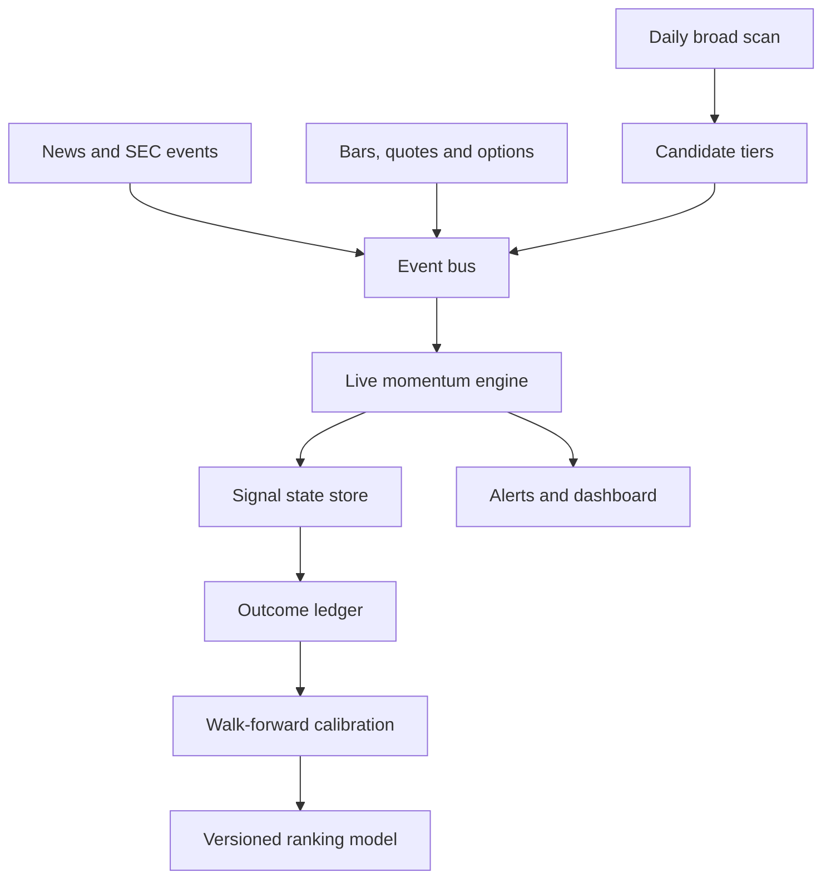

# Market Hunt V4 Architecture

Status: **V4.1 continuous-monitoring implementation / shadow mode**. V3 remains
the production path until the validation gates below pass. V4 never enables
broker execution.

## Objective

Identify developing liquid U.S. stocks capable of a 10%+ move, estimate the
probability from measured outcomes, and promote a setup only when its catalyst,
price, volume, risk/reward and live confirmation become actionable.

## Target topology



## Bounded contexts

| Context | Responsibility | V4 foundation status |
| --- | --- | --- |
| Discovery | Full-universe quality gates, themes, structures and 10% capability | Reuses proven V3 |
| Candidate routing | HOT/WARM tiers with a bounded live-data budget | Implemented |
| Event ingestion | Normalize bars, quotes, catalysts, options and tape | Contract plus parallel Yahoo polling adapter implemented |
| Live momentum | Deterministic WATCH → ARMED → TRIGGERED → CONFIRMED lifecycle | Continuous shadow worker implemented |
| State/event storage | Idempotent append-only events plus current signal state | File shadow adapter implemented |
| Catalyst intelligence | SEC/news classification and magnitude | Existing batch logic; streaming adapter planned |
| Outcome intelligence | MFE, MAE, +5/+10/+15%, R-multiple and failure reason | Existing journal; V4 event ledger planned |
| Calibration | Walk-forward probabilities by setup and regime | Existing baseline; leakage-safe V4 model planned |
| Delivery | Mobile dashboard and actionable alerts | Deduplicated audit/Telegram alert router implemented |

## Core design rules

1. **V3 stays live during migration.** V4 first consumes V3 outputs in shadow mode.
2. **Provider-neutral events.** Paid streaming data can replace Yahoo polling without rewriting decision logic.
3. **Signal identity, not ticker identity.** `ticker|entry|stop` prevents a completed AXTI setup from contaminating a later AXTI setup.
4. **Terminal-state integrity.** TARGET_HIT, INVALIDATED and FAILED_BREAKOUT remain final for that signal.
5. **Idempotent processing.** Stable event IDs prevent workflow retries from duplicating events or alerts.
6. **No self-learning in production without evidence.** Weight changes require time-split validation, minimum samples and rollback metadata.
7. **Research only.** V4 does not place orders and makes no return guarantee.

## Event contract

All inputs use schema `4.0.0` and contain:

- `event_id`
- `event_type`
- `ticker`
- `signal_id`
- `observed_at_utc`
- `source`
- `payload`

Initial event types cover candidate snapshots, price bars, quotes, catalysts,
options flow, microstructure, state transitions and outcomes.

## Rollout gates

| Phase | Deliverable | Promotion requirement |
| --- | --- | --- |
| 4.0 | Contracts, shortlist tiers, state engine, shadow store | Unit tests and replay determinism |
| 4.1 | Continuous live adapter and alert router | Implemented in shadow; ≥95% market-hours uptime and p95 event-lag evidence still required |
| 4.2 | Outcome ledger and replayable backtester | No look-ahead leakage; fill/slippage assumptions documented |
| 4.3 | SEC/news event adapters | Source timestamps, deduplication and false-positive review |
| 4.4 | Options/microstructure adapters | Provider/licensing approved; missing-data behavior tested |
| 4.5 | Calibrated ranking model | Adequate out-of-sample signals and improvement over frozen baseline |
| 4.6 | Production cutover | Shadow agreement, alert precision and rollback drill pass |

## Operational targets

- Broad scan: retain current approximately 6.5-minute full-universe baseline.
- Candidate set: configurable HOT and WARM tiers; 100 in the free shadow adapter,
  expandable to 300–600 with streaming data.
- Event processing: deterministic and replayable; no network access in the core engine.
- Availability: degraded providers lower confidence and never silently fabricate confirmation.
- Deployment: separate V4 worker from the Streamlit dashboard process.

## V4.1 worker behavior

- Pulls the newest `all_candidates.csv` from the `scan-data` branch with a
  local-output fallback.
- Monitors all HOT names every cycle and rotates a WARM batch every fifth cycle.
- Polls independent symbols concurrently through a provider-neutral adapter.
- Measures source age, provider duration, provider errors, event-lag p95 and
  market-hours uptime.
- Routes actionable transitions once per channel. Failed channels remain
  retryable without duplicating successful deliveries.
- Handles `SIGTERM`/`SIGINT` by refusing a new cycle, finishing the active one,
  flushing state/health and exiting normally.
- Runs every 60 seconds during an open NYSE session and every 15 minutes outside
  market hours by default.

The optional Render template is `render.v4-worker.yaml`. It is deliberately
separate from the production `render.yaml`, has `autoDeployTrigger: off`, and must
not be activated until shadow evidence justifies the paid worker.
Its smallest persistent disk preserves signal state, alert deduplication and
health history across restarts. That disk makes the worker single-instance and
removes zero-downtime deploys, which is acceptable for shadow validation but
must be revisited before commercial scaling.

## Current shadow commands

```bash
python -m scanner.v4_live --hot-limit 20 --warm-limit 80 --fetch-limit 20

# One V4.1 cycle
python -m scanner.v4_worker --once

# Continuous V4.1 shadow worker
python -m scanner.v4_worker
```

The worker writes snapshots, transitions, alert audit records, per-cycle
metrics and an aggregate health summary. It does not replace the production
monitor or place trades.
